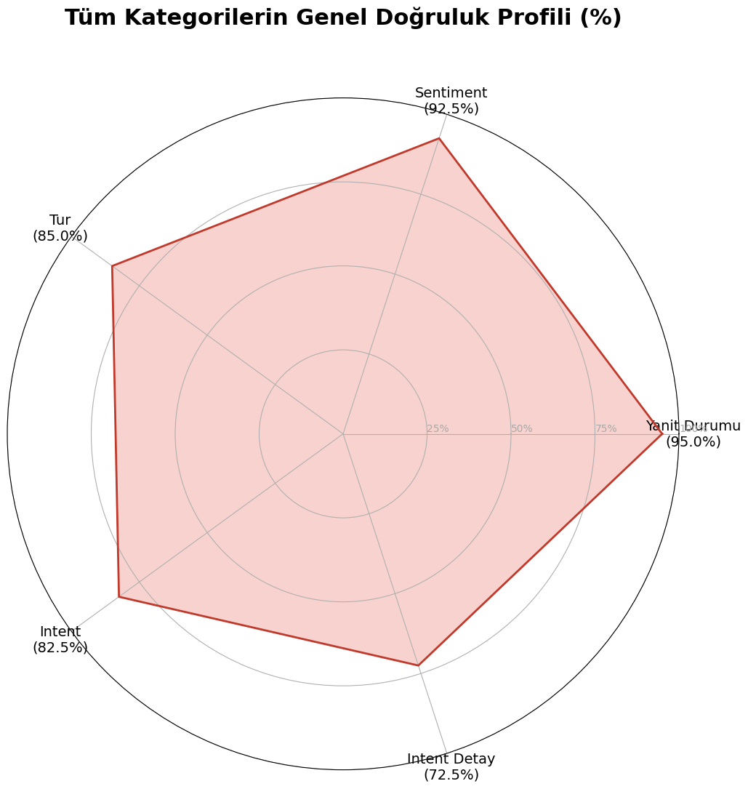
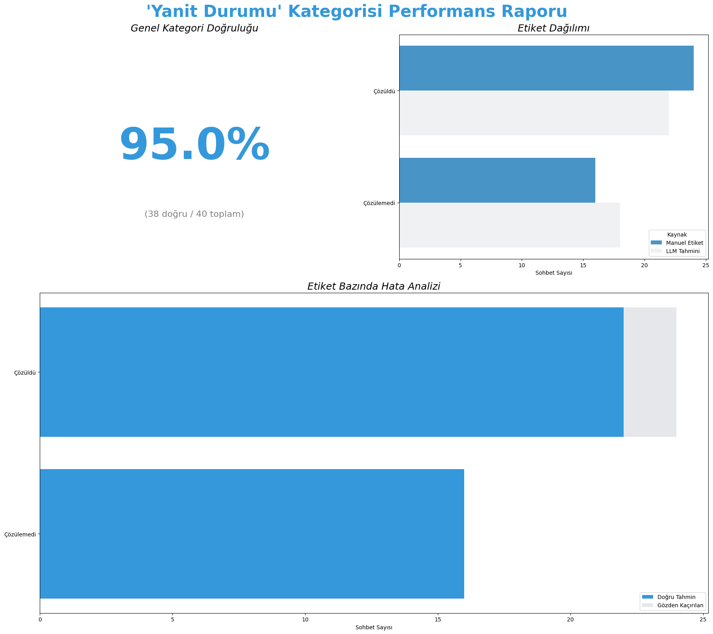
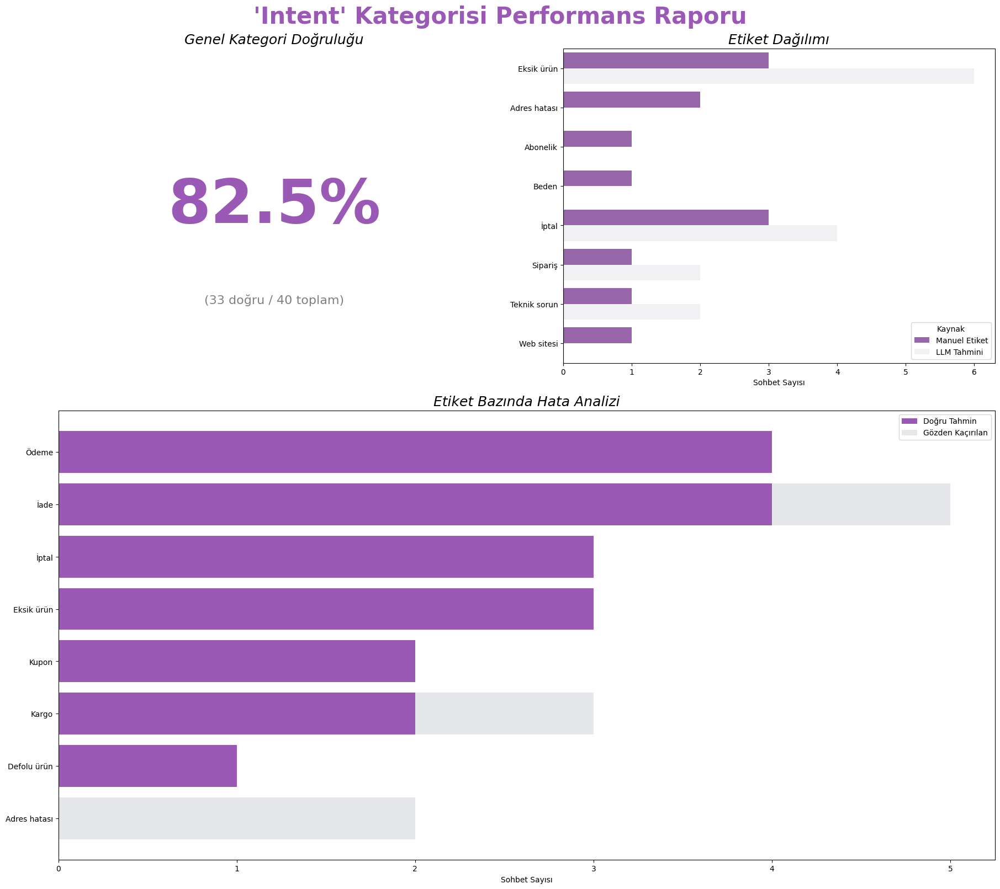
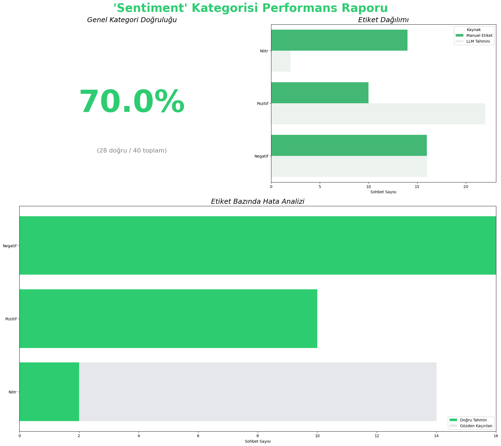
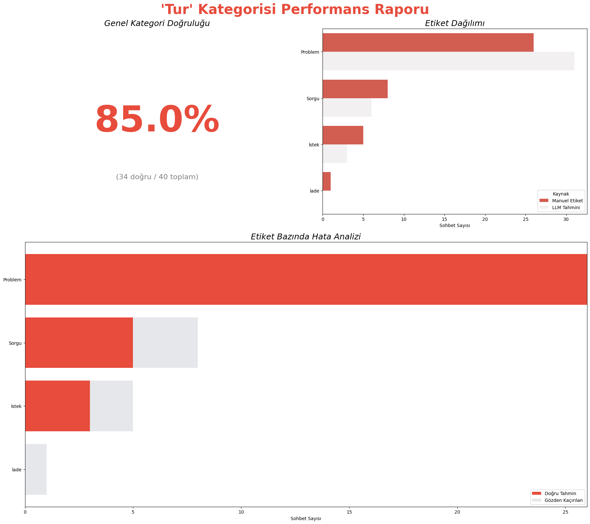

  

  

  
  
  
  
  
  

# 🧠 Grispi AI Müşteri Hizmetleri Analiz Aracı: Prototip Sunumu

Bu proje, Grispi'nin yapay zekâ destekli müşteri hizmetleri analiz aracının ilk, çalışan prototipini sunmaktadır. Proje kapsamında, Trendyol Mila Chatbot'u ile yapılan 20 adet müşteri sohbeti, `Ollama` üzerinde lokal olarak çalıştırılan `Command-R` modeli kullanılarak analiz edilmiş ve sonuçlar görsel raporlara dönüştürülmüştür.

- ✅ **Akıllı Yönlendirme & Hata Düzeltme** → Yapay zekâya ne yapacağını, nasıl düşüneceğini ve nasıl karar vereceğini öğreten hibrit bir prompt mühendisliği yaklaşımı.
- 📊 **Kapsamlı Dashboard Raporları** → Her kategori için model performansını, etiket dağılımını ve hata analizini birleştiren PNG formatında görsel raporlar.
- 🧾 **Karşılaştırmalı Excel Analizi** → Manuel ve LLM etiketlerini yan yana gösteren, eşleşme durumuna göre otomatik renklendirilmiş, detaylı `.xlsx` raporu.
- 🚀 **Lokal ve Açık Kaynak** → Pahalı API'ler yerine, `Ollama` aracılığıyla lokalde çalıştırılan `Command-R` modeli ile esneklik ve maliyet avantajı.

📊 **Özet Skorlar (Manuel Etiketler vs LLM Tahminleri)**

Veri seti: 40 sohbet · Model: `Command-R` (via Ollama)
Ölçüm: Kategori bazlı doğruluk (Accuracy) - *`tur` kategorisi birleştirilmiş etiketlere göre ölçülmüştür.*

| Kategori | Doğruluk (%) |
| :--- | :---: |
| **Yanıt Durumu** | 95.00 |
| **Intent** | 82.50 |
| **Tur (Problem/Sorgu)** | 85.00 |
| **Intent Detay** | 72.50 |
| **Sentiment** | 92.50 |

Son güncelleme: 2 Ekim 2025 · Analiz Aracı: Google Colab Notebooks
---

## 🧭 İçindekiler

- [Projenin Amacı](#-projenin-amacı)
- [Metodoloji ve İş Akışı](#-metodoloji-ve-i̇ş-akışı)
- [Proje Bileşenleri](#️-proje-bileşenleri)
- [Nasıl Çalıştırılır?](#-nasıl-çalıştırılır)
- [Üretilen Çıktılar](#-üretilen-çıktılar)
- [Lisans](#️-lisans)
- [Katkı](#-katkı)

---

## 🎯 Projenin Amacı

Bu projenin temel amacı, Grispi'nin yapay zekâ destekli müşteri hizmetleri analiz aracının ilk, çalışan prototipini geliştirmektir. Bu kapsamda, sağlanan sohbet kayıtları Yapay Zeka (AI) kullanılarak analiz edilmiş, otomatik etiketleme yapılmış, sonuçların doğruluğu ölçülmüş ve eyleme geçirilebilir raporlar ile içgörüler üretilmiştir.

---

## 🌊 Metodoloji ve İş Akışı

Analiz sürecimiz dört temel adımdan oluşmaktadır:

1.  **Veri Kaynağı:** `20-sohbet-trendyol-mila.json` dosyasından 20 adet sohbet kaydı ham veri olarak kullanılmıştır.
2.  **AI Analizi:** Her bir sohbet, `Ollama` üzerinde çalışan `Command-R` Büyük Dil Modeli ile bütünsel bir yaklaşımla analiz edilerek 5 ana kategoride etiketlenmiştir.
3.  **Doğruluk Ölçümü:** Modelin ürettiği tahminler (`llm.csv`), referans kabul edilen manuel etiketler (`ground_truth.xlsx`) ile her kategori için karşılaştırılarak doğruluk yüzdeleri hesaplanmıştır.
4.  **Raporlama:** Elde edilen verilerle, model performansını ve müşteri eğilimlerini gösteren kapsamlı görsel raporlar (Dashboard'lar, SWOT, Excel) oluşturulmuştur.

---

## ⚙️ Proje Bileşenleri

Bu proje, her biri belirli bir görevi yerine getiren bir dizi araçtan (Google Colab Notebook) oluşur:

### 1. AI Etiketleme Motoru
- **Açıklama:** Ham sohbet verilerini alır, `Ollama` ve `Command-R` kullanarak her bir sohbeti etiketler. Projenin ana "beynidir".
- **Çıktı:** Tüm sohbetler için hem ham hem de birleştirilmiş etiketleri içeren `llm.csv` dosyası.

### 2. Performans Dashboard Üretici
- **Açıklama:** Analiz sonuçlarını kullanarak, her bir kategori için modelin performansını detaylıca gösteren kapsamlı görsel raporlar (dashboard) üretir.
- **Çıktı:** 5 adet kategori bazlı `.png` dashboard ve 1 adet genel özet `.png` radar grafiği.

<b>📊 Görsel Rapor Galerisi (Genişletmek için tıklayın)</b>

  <em>Genel Performans Özeti (Radar Grafiği)</em> 
  
    
  <em>Yanıt Durumu Kategorisi Raporu</em> 
  
    
  <em>Intent Kategorisi Raporu</em> 
  
    
  <em>Intent Detay Kategorisi Raporu</em> 
  
      
  <em>Sentiment Kategorisi Raporu</em> 
  
    
  <em>Tur Kategorisi Raporu</em> 
  

### 3. Karşılaştırmalı Excel Raporu Üretici
- **Açıklama:** Manuel etiketler ile LLM tahminlerini her bir sohbet için yan yana getirir. Tahminlerin doğru (yeşil) veya yanlış (kırmızı) olduğunu görsel olarak işaretler ve sohbetin tam metnini içerir.
- **Çıktı:** `Karsilastirmali_Analiz_Raporu.xlsx` dosyası.

---

## 🚀 Nasıl Çalıştırılır?

Proje, her biri belirli bir görevi yerine getiren bir dizi Google Colab notebook'undan oluşur. Her bir notebook'un başında, hangi dosyaları yüklemeniz gerektiği ve nasıl çalıştırılacağı açıklanmaktadır.

1.  Çalıştırmak istediğiniz araca ait `.ipynb` dosyasını Google Colab ile açın.
2.  Notebook'un başındaki talimatlara göre gerekli kaynak dosyaları (örn: `ground_truth.xlsx`, `llm.csv`) yükleyin.
3.  Hücreleri yukarıdan aşağıya doğru sırayla çalıştırın.
4.  Analiz tamamlandığında, üretilen rapor dosyası (örn: `.png`, `.xlsx`) otomatik olarak indirilecektir.

---

## 📤 Üretilen Çıktılar

Bu araç setini kullanarak aşağıdaki raporları ve analiz dosyalarını üretebilirsiniz:
- `llm.csv` (AI Etiketleme Sonuçları)
- `assets/` klasöründeki `.png` dosyaları (Görsel Performans Raporları)
- `Karsilastirmali_Analiz_Raporu.xlsx` (Renklendirilmiş Excel Raporu)
- `Trendyol Mila Sohbet Botu AI Analiz Ödevi.pptx` (Proje Sunumu)
  - *Not: Detaylı SWOT analizi ve geliştirme önerileri bu sunum dosyasının içinde yer almaktadır.*

## 🆕 Yeni Eklenen Dosyalar

### 📋 Dokümantasyon ve Kaynaklar
- **`prompt_koleksiyonu_guncel.txt`** - Tüm güncel prompt şablonları ve LLM konfigürasyonları
- **`teknik_detaylar_ve_kullanim.txt`** - Teknik implementasyon rehberi ve kullanım örnekleri
- **`create_presentation.py`** - Otomatik PowerPoint sunum oluşturucu

### 💻 Kaynak Kodlar (`src/` klasörü)
- **`llm_infer.py`** - Ana LLM çıkarım motoru (Pydantic validasyonlu)
- **`eval_pipeline.py`** - Uçtan uca değerlendirme pipeline'ı
- **`data_load.py`** - Veri yükleme ve işleme fonksiyonları
- **`metrics_eval.py`** - Performans metrik hesaplama ve raporlama
- **`prompt_template.txt`** - Ana prompt şablonu (%85+ doğruluk)

### 🔧 Yardımcı Araçlar
- **`calculate_accuracy.py`** - Doğruluk hesaplama scriptleri
- **`generate_reports.py`** - Görsel rapor oluşturucu
- **`json_to_xlsx.py`** - Veri format dönüştürücü

---

## 🛡️ Lisans

Bu proje **MIT Lisansı** ile lisanslanmıştır.

---

## 🤝 Katkı
**Hazırlayan:** Aslı Aktaş — iyileştirme önerilerinizi bekliyoruz! ✨
